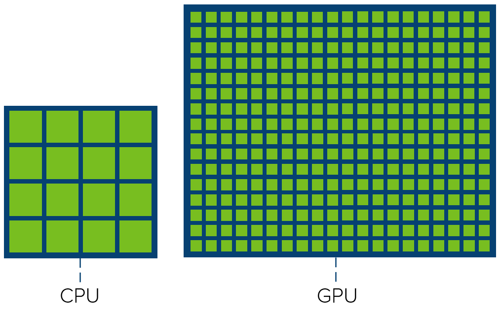
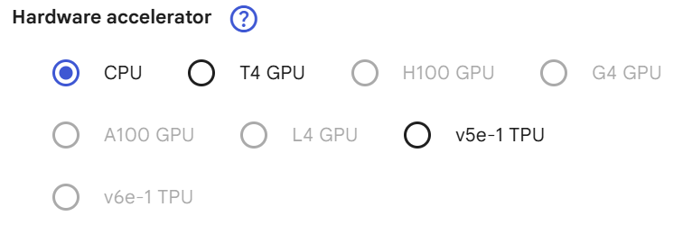

Trong huấn luyện mô hình, thời gian và bộ nhớ là 2 yếu tố quyết định quan trọng cho hiệu quả của *code*. Nhanh hơn và tiết kiệm bộ nhớ hơn là hai bài toán cần tối ưu.

3 bước cơ bản trong thuật toán học máy:
- Decision process: dự đoán, phân loại 
- Error function: tự đánh giá đầu ra dựa vào các lỗi đã biết
- Model optimization process: Liên tục đánh giá các dự đoán (lặp quá trình, chính xác theo thời gian)

## CPU
Central Processing Unit = RAM + Cache + CU + AU. 

**`Thực hiện tuần tự`**

> Khi nào dùng CPU?

Trong môi trường web server, app AI hay ChatBot (mô hình đã được huấn luyện sẵn), tính toán cơ bản, hệ thống chỉ cần suy luận nhanh nhất có thể. Lúc này CPU được sử dụng phổ biến nhất, vì:
- Suy luận nhẹ không cần đến GPU
- Tốc độ phản hồi thấp
- Postprocessing


## GPU
Graphical Processing Unit = [CPU CPU CPU]. GPU tính toán lượng công việc lớn cùng một lúc. Hầu hết các mạng neural đều được huấn luyện qua GPU device. 

**`Thực hiện song song`**

> Khi nào cần GPU?

## Huấn luyện mô hình trên CPU 
- [Training AI Models on CPU](https://towardsdatascience.com/training-ai-models-on-cpu-3903adc9f388/)
- [Training Models - Pytorch step-by-step](https://www.codegenes.net/blog/pytorch-cpu-training/)

### Tensors 
```python
# Kiểm tra thiết bị 
tensor_array = torch.tensor([1.5, 8.9, 3], [2.3, 4.4, 9.802])
print(f"Thiết bị lưu trữ: {tensor_array.device}")
```

### Computational Graph
```python
nn_linear = nn.Linear(32, 4) # Lớp mạng Neural
input_tensor = torch.rand(3, 5, 32, dtype = torch.float)
Oput = nn_linear(input_tensor)
```

### Neural models
```python
class MyModel(nn.Module):
    def __init__(self, input_size, output_size):
        super().__init__:
        self.linear = nn.Linear(input_size, output_size)
    def forward(self, x):
        return self.linear(x)
```

|Batch Size|Step time (s)|Throughput (sps)|
|---|---|---|
|input()|end_time - start_time|batch_size / step_time|

## Huấn luyện mô hình trên GPU

> Which GPU for Deep Learning/ Machine Learning? Not free



|T4 GPU|
|---|
|NVIDIA Tesla T4|
|15360MiB|
|có VRAM riêng, nhanh hơn CPU ~ x10 lần|

## Các cách luyện tập phổ biến
### a. Data Loading

```python
# Thư viện
torch.utils.data
# Hàm
TensorDataset()
DataLoader()
```

### b. Model Evaluation
Sau khi huấn luyện, cần đánh giá mô hình dựa trên bộ xác thực/kiểm thử.