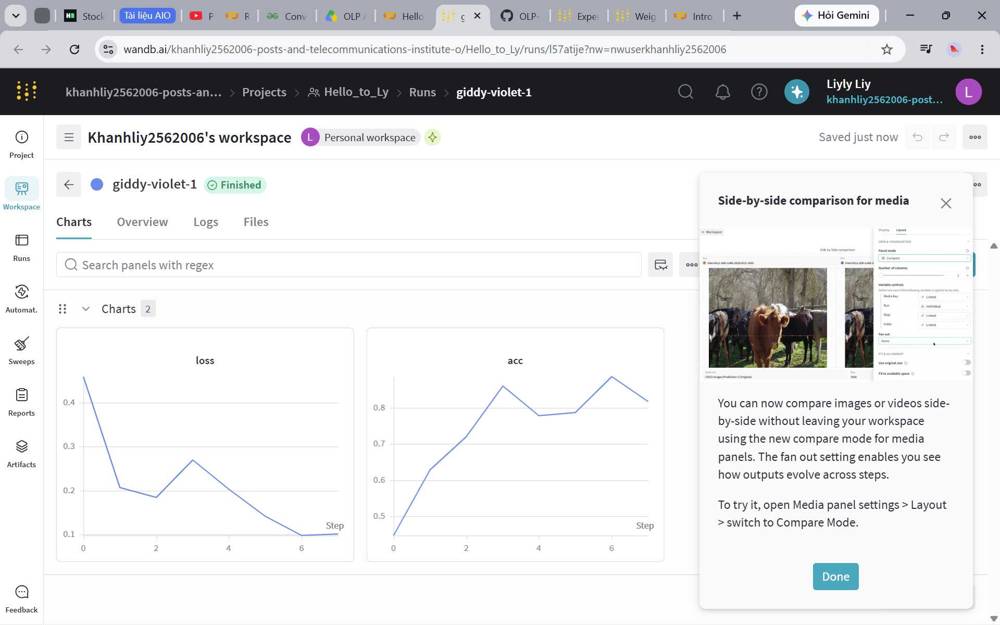

> Weights and Biases là gì?
[Link Website - WANDB](https://wandb.ai/site/experiment-tracking/)

> Tại sao cần tracking?
- Quên tham số mang lại kết quả tốt nhất (accuracy/loss)
- Chia sẻ track với người khác
- Gợi ý tham số 

## Công cụ chính của Weight&Biases
- Workplace: Tạo biểu đồ, hiện thông tin hệ thống 
- Artifacts: Quản lý các phiên bản của tập dữ liệu (start-end)
- Table: Hiển thị thông tin thử nghiệm, giá trị tham số
- Sweeps: Điều chỉnh tham số/tối ưu mô hình
- Report: Lưu + chia sẻ 

